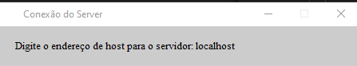
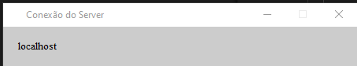
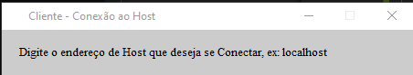
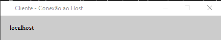
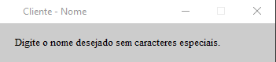
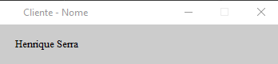
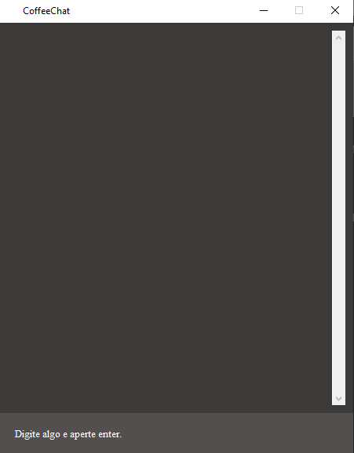
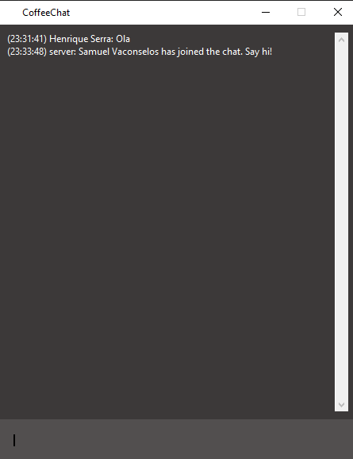
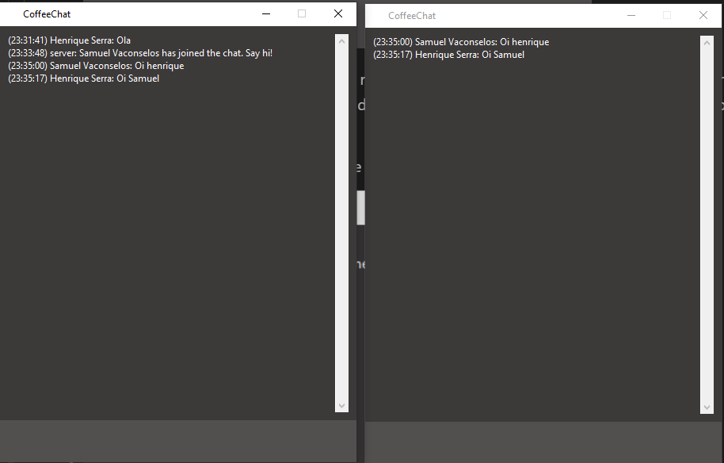

[![Contributors][contributors-shield]][contributors-url]
[![Forks][forks-shield]][forks-url]
[![Stargazers][stars-shield]][stars-url]
[![Issues][issues-shield]][issues-url]
[![MIT License][license-shield]][license-url]

<!-- PROJECT LOGO -->
<br />
<p align="center">
  <a href="https://github.com/othneildrew/Best-README-Template">
    
  </a>

  <h3 align="center">Projeto Coffee-Chat</h3>

  <p align="center">
    Projeto desenvolvido para matéria de Redes 1
    <br />
    <a href="https://adrielfabricio.github.io/coffee-chat/"><strong>Documentação do código do projeto</strong></a>
    
    
  </p>
</p>

<!-- TABLE OF CONTENTS -->
<details open="open">
  <summary>Sumário</summary>
  <ol>
    <li>
        <a href="#sobre-o-projeto">Sobre o projeto</a>
        <ul>
            <li><a href="#ferramentas">Ferramentas</a></li>
            <li><a href="#pré-requisitos">Pré-requisitos</a></li>
            <li><a href="#instalação">Instalação</a></li>
        </ul>
    </li>
    <li>
        <a href="#como-começar">Como começar</a>
        <ul>
            <li><a href="#servidor">Servidor</a></li>
            <li><a href="#clientes">Clientes</a></li>
        </ul>
    </li>
    <li>
        <a href="#contribuidores">Contribuidores</a>
    </li>
  </ol>
</details>

## Sobre o projeto

O projeto é de criação de um chat que conecte diversas pessoas na mesma rede. Ele se chama coffee-chat por nossa paixão por café (exceto Samuel) e por ser nosso melhor companheiro na horas mais tardias enquanto programamos.

O projeto foi testado para plataformas windows 10 e ubuntu 20.04.

### Ferramentas

Para esse projeto utilizamos o python3 e mó

### Pré-requisitos

Para rodar o projeto é necessário ter instalado:

- python3 (^v3.8)
- pip3 (^v20)
  - tkinter (para interface)
  - win10toast (para windows)

### Instalação

Para baixar o python3 basta clicar acessa o [python.org](https://www.python.org/download/releases/3.0/)

Caso para instalar o tkinter e win10toast basta rodar esse comando após a instalação do python3 e pip3

```shell
$ pip3 install tkinter

$ pip3 install win10toast
```

## Como começar

O projeto é dividido em servidor e cliente. O servidor conectar e gerencia todas as requisições dos clientes. O cliente se comunica com o servidor mandando mensagens e renderiza o retorno dele.

Para rodar o projeto é preciso iniciar um servidor em um endereço IP na rede que os demais clientes possam acessar. Em seguinda é necessário conectar os clientes com esse IP.

### Servidor

Para iniciar o servidor rode o seguinte comando

```shell
$ python3 server.py
```

Após rodar esse comando irá aparecer a seguinte caixa de texto, basta clicar no texto dela e digitar o IP onde o servidor irá rodar e depois aperta `ENTER`




Com isso o servidor estará pronto para receber os clientes

### Clientes

Para iniciar um cliente basta abrir outro terminal, caso esteja no mesmo computador do servidor, e rodar o seguinte comando

```shell
$ python3 client.py
```

Irá abrir uma caixa semelhante ao do servidor, basta preencher com o IP do seu servidor e depois aperta em `ENTER`




Em seguida, irá abrir uma nova caixa pedindo para o nome de identificação do usuário




Após preencher o nome do usuário irá abrir uma janela para o chat



Para testar basta digitar algo e enviar. **Atenção!** o input do chat não aceita caracteres especiais.


Para criar um novo chat basta abrir um novo terminar e rodar o comando para rodar o cliente novamente e preencher com os dados do servidor, o mesmo vale para caso esteja testando em outro computador.

Quando um novo usuário entra na rede os usuários já existentes são notificados



É possivel conectar diversos usuários ao chat, no windows 10 sempre que tiver uma nova mensagem aparecerá ela na notificação do SO



## Contribuidores

- [Adriel Fabricio](https://github.com/adrielfabricio)
- [Diêgo Marcelino](https://github.com/marcelinodiego)
- [Henrique Serra](https://github.com/SerraZ3)
- [Samuel Mendonça](https://github.com/Syphoon)

<!-- MARKDOWN LINKS & IMAGES -->
<!-- https://www.markdownguide.org/basic-syntax/#reference-style-links -->

[contributors-shield]: https://img.shields.io/github/contributors/adrielfabricio/coffee-chat.svg?style=for-the-badge
[contributors-url]: https://github.com/adrielfabricio/coffee-chat/graphs/contributors
[forks-shield]: https://img.shields.io/github/forks/adrielfabricio/coffee-chat.svg?style=for-the-badge
[forks-url]: https://github.com/adrielfabricio/coffee-chat/network/members
[stars-shield]: https://img.shields.io/github/stars/adrielfabricio/coffee-chat.svg?style=for-the-badge
[stars-url]: https://github.com/adrielfabricio/coffee-chat/stargazers
[issues-shield]: https://img.shields.io/github/issues/adrielfabricio/coffee-chat.svg?style=for-the-badge
[issues-url]: https://github.com/adrielfabricio/coffee-chat/issues
[license-shield]: https://img.shields.io/github/license/adrielfabricio/coffee-chat.svg?style=for-the-badge
[license-url]: https://github.com/adrielfabricio/coffee-chat/blob/main/LICENSE
[linkedin-shield]: https://img.shields.io/badge/-LinkedIn-black.svg?style=for-the-badge&logo=linkedin&colorB=555
[linkedin-url]: https://linkedin.com/in/othneildrew
[product-screenshot]: images/screenshot.png
